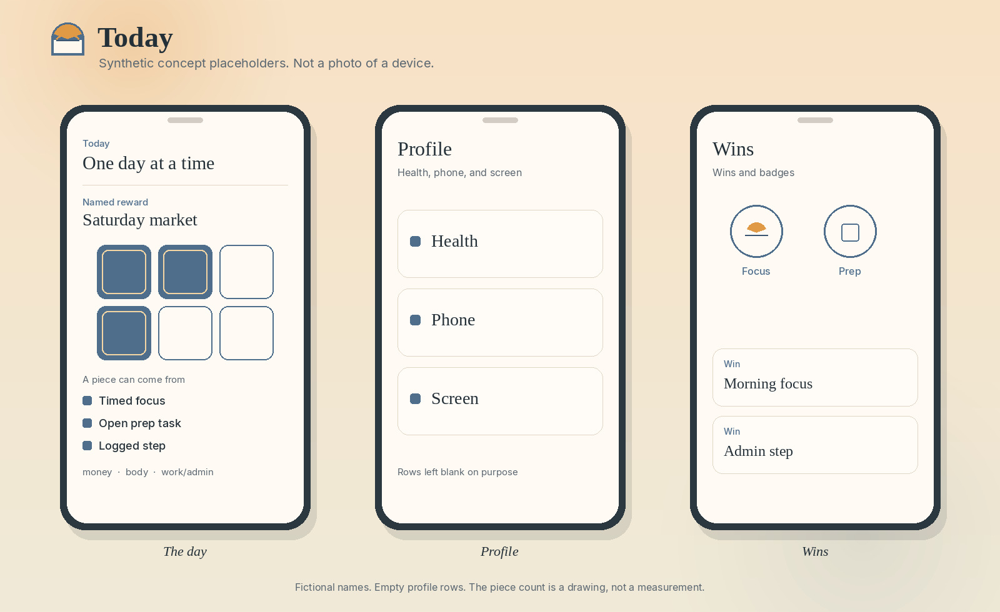

# Today, visual product direction

> **Status:** synthetic placeholders. A private Android prototype is noted at 0.5.4, with no Play Store listing and no public APK. These images are drawn concept boards, not photos of a personal device, and not screenshots of that build. Every name on them is made up.

## The visual job

The screen should feel like early light on paper. One named reward is in view. The next piece has a plain reason: timed focus, a prep task, or a logged step. Profile and Wins stay reachable without turning the day into a chart.

The visual system is built around three questions:

1. What reward did I name?
2. Which action revealed a piece: timed focus, an open prep task, or a logged step?
3. Where do health, phone, and screen sit, and where do wins and badges sit?

## The three concept screens

### The day

The in-app title is One day at a time. A named reward is a puzzle on dawn paper. Filled pieces and empty pieces are both visible, so progress is a picture rather than a lone total. Under the puzzle, the three ways to reveal a piece stay in view: timed focus, an open prep task, and a logged step under money, body, or work/admin.

The reward name on the board, Saturday market, is fictional. The number of filled pieces is a drawing choice. It is not a measurement from the prototype.

### Profile

Profile is three areas: health, phone, and screen. The concept screen names those areas and leaves the values blank. A blank row is intentional. This repository does not publish real health, phone, or screen figures.

### Wins

Wins lists wins and badges in the same paper system. A badge is drawn as a mark of its own, not as a puzzle piece, so the two ideas stay distinct. The win titles on the board are examples, not a record from use.

## Visual language

- Dawn paper for the ground: warm, early, and quiet
- Ink for titles and labels
- Steel blue for the accent, for a revealed puzzle piece, and for structure
- A morning sun as the launcher mark
- Rounded paper surfaces with clear edges
- Short labels, without scoreboard language or a dense chart

## Picture rules

- Use synthetic names or empty rows.
- Do not use a personal device photo.
- Do not present the concept board as a screenshot of the 0.5.4 prototype.
- Do not imply a Play Store listing.
- Do not fill Profile with invented measurements.

## What the board shows

- The in-app title, One day at a time, and a fictional named reward
- Puzzle pieces with the three ways to reveal one still in view
- Profile as health, phone, and screen, with the rows left blank
- Wins and badges drawn apart from the puzzle
- A morning-sun mark and a steel-blue accent on dawn paper

It does not show a personal device, a Play Store listing, or a measurement from the prototype.

## Public boundary

The public visuals are placeholders. Real days, device photos, and application code remain private.
